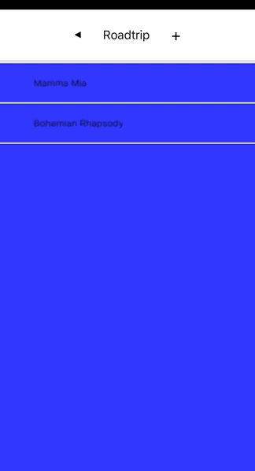

# User Guide
This app allows users to view their playlists in a list, navigate into each playlist to view their songs, and assign songs to each playlist. The project is built using React Native and TypeScript, coupled with React Native Navigation to handle routing.



## Main Technologies Used
- [React Native]
- [TypeScript]
- [React Native Navigation]

## Running the project
- Clone this project.
```
git clone < project-url.git >
```
- After cloning this project, go to the folder.
```
cd Playlist
```
- Install all dependencies that are used by Playlist.
```
npm install
```
- Lastly, to run this project, type this command:
```
npm run ios
```
